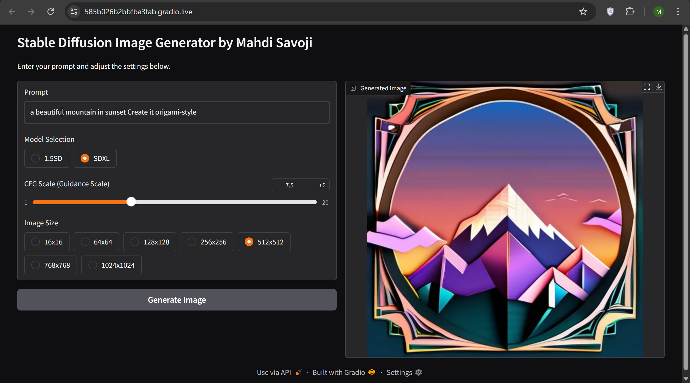
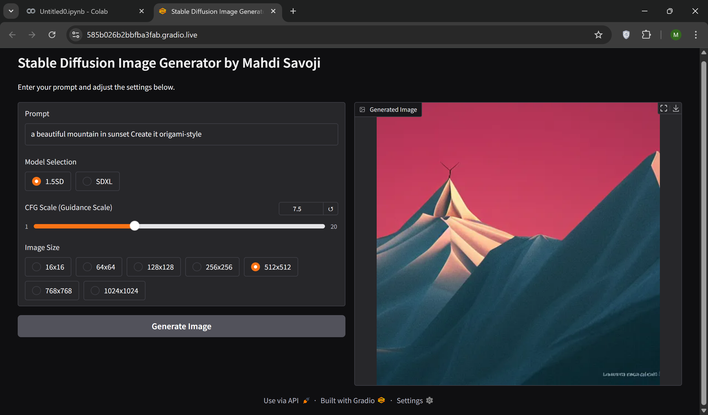
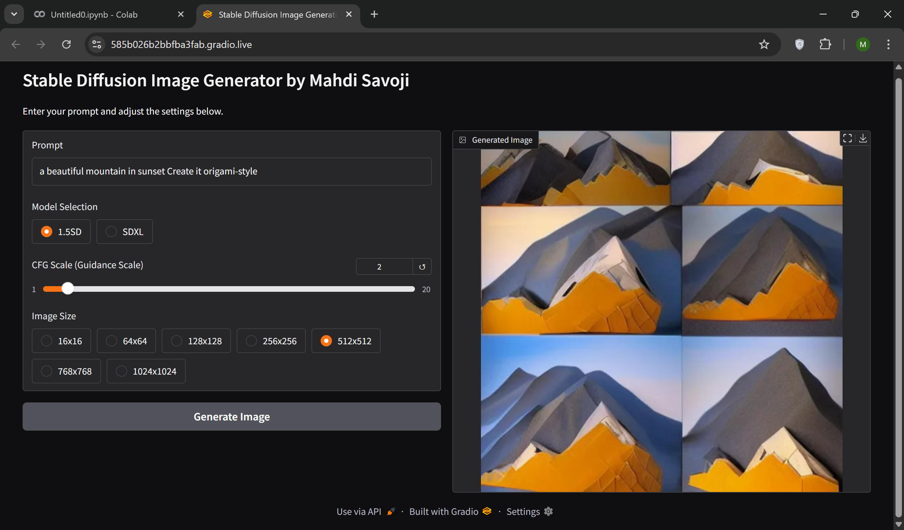
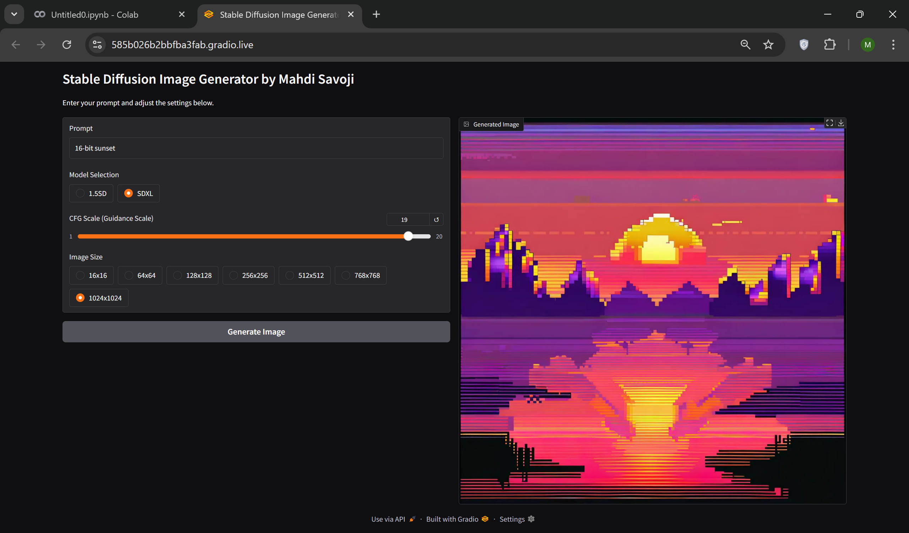
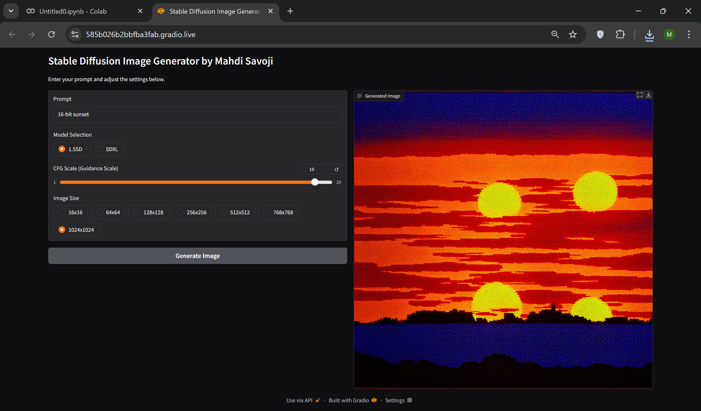
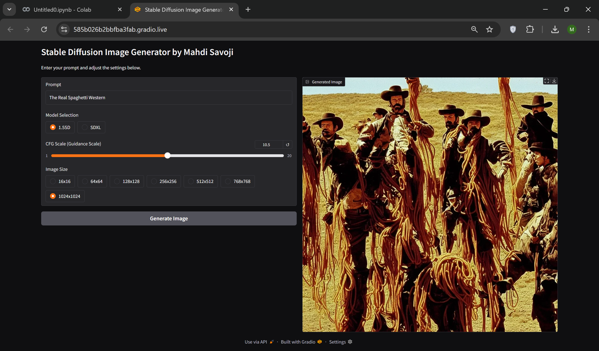
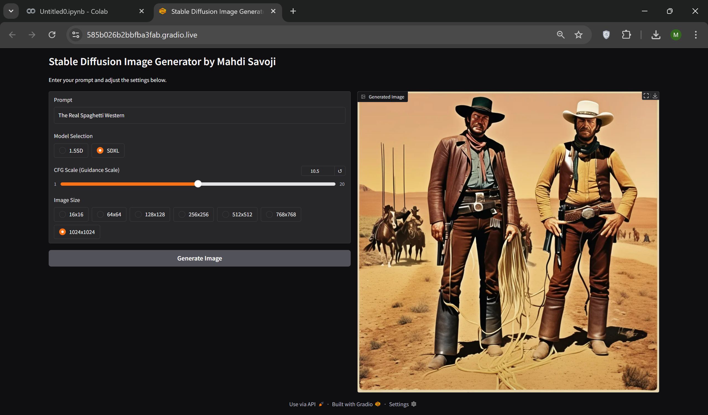
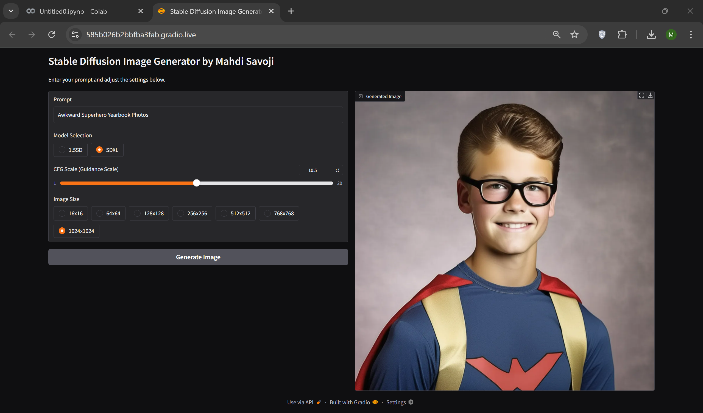

## Stable Diffusion Text-to-Image Generator with Gradio


[](Text2ImageGenerator-Gradio.ipynb)

## 🚀 Features
- Generate images from text prompts using either Stable Diffusion 1.5 or SDXL
- Adjustable guidance scale (CFG) for precise control
- Multiple image size options (from 16x16 to 1024x1024)
- Simple Gradio web interface
- GPU acceleration support (CUDA)

## 🛠️ Installation

### Prerequisites
- Python 3.7+
- Git
- NVIDIA GPU (recommended)

### Setup	
```bash
git clone https://github.com/your-username/StableDiffusion-Text2ImageGenerator-Gradio.git
cd StableDiffusion-Text2ImageGenerator-Gradio
pip install -r requirements.txt
```

## 💻 Usage

When run the application:

The interface will be available at:

- Local URL: `http://127.0.0.1:7860`
- Public URL (when using `share=True`)

## 🖼️ Example Outputs

<div align="center">
  <table>
    <tr>
      <td align="center"></td>
      <td align="center"></td>
    </tr>
    <tr>
      <td align="center"><em>Prompt: "a beautiful mountain in sunset create in origami-style"</em></td>
      <td align="center"><em>Prompt: "a beautiful mountain in sunset create in origami-style"</em></td>
    </tr>
    <tr>
      <td align="center"></td>
      <td align="center"></td>
    </tr>
    <tr>
      <td align="center"><em>Prompt: "a beautiful mountain in sunset create in origami-style"</em></td>
      <td align="center"><em>Prompt: "16-bit sunset"</em></td>
    </tr>
    <tr>
      <td align="center"></td>
      <td align="center"></td>
    </tr>
    <tr>
      <td align="center"><em>Prompt: "16-bit sunset"</em></td>
      <td align="center"><em>Prompt: "The real spaghetti western"</em></td>
    </tr>
    <tr>
      <td align="center"></td>
      <td align="center"></td>
    </tr>
    <tr>
      <td align="center"><em>Prompt: "The real spaghetti western"</em></td>
      <td align="center"><em>Prompt: "awkward superhero yearbook photos"</em></td>
    </tr>
  </table>
</div>


## ⚙️ Configuration Options
| Parameter  | Description                                                  | Recommended Value                  |
| ---------- | ------------------------------------------------------------ | ---------------------------------- |
| Model      | Choice between 1.5SD (faster) and SDXL (higher quality)      | SDXL for best results              |
| CFG Scale  | How closely to follow the prompt                             | 7-12 (balance creativity/accuracy) |
| Image Size | Output resolution                                            | 512x512 (1.5SD), 1024x1024 (SDXL)  |
| Steps      | Number of denoising steps (higher = better quality but slower) | 50-150 (50 default)                |

## 📦 Requirements

```
gradio>=3.0
diffusers>=0.11.0
torch>=1.12.0
accelerate
transformers
```

## 🙏 Acknowledgments

- [Stability AI](https://stability.ai/) for the Stable Diffusion models
- [Hugging Face](https://huggingface.co/) for the Diffusers library
- [Gradio](https://gradio.app/) for the UI framework

------

<div align="center"> Made with Mahdi Savoji </div> ```


